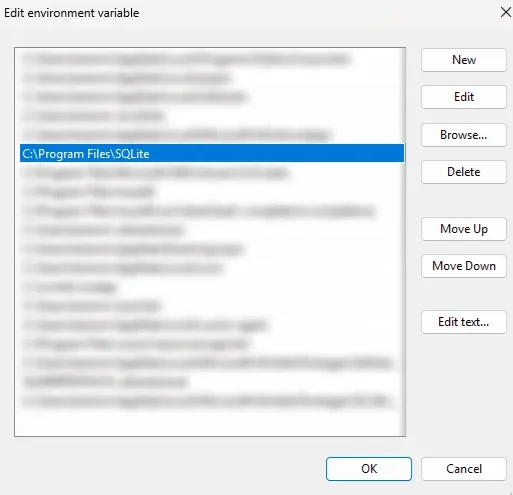

import ChapterRef from "@components/ChapterRef.astro";

## Installing the command line shell

There is no server to install, so there is nothing to configure and nothing to
start. What you install is a single executable called `sqlite3`, which is a
program that links the same library your application will link and gives you a
prompt in front of it.

Two things are worth separating before you start. The shell is a convenience,
not a dependency. Your application does not call it, does not need it on the
machine, and does not share a version with it. The `sqlite3` on your `PATH` and
the SQLite compiled into your driver are two independent copies of the engine,
and they are frequently different versions. <ChapterRef id="ecosystem-map" />
covers why, and the end of this chapter comes back to it.

### Windows

The official route is a zip file with no installer. On the download page at
`sqlite.org/download.html`, take the bundle named
`sqlite-tools-win-x64-<version>.zip`. The version in the filename is the release
number with each component padded to two digits and a trailing `00`, so
`3530400` is 3.53.4. Extract it somewhere permanent, such as
`C:\Program Files\SQLite`, and add that folder to `PATH`.

The zip holds four executables. `sqlite3.exe` is the shell. The other three are
`sqldiff.exe`, which reports the differences between two databases,
`sqlite3_analyzer.exe`, which reports how space inside a database file is being
spent, and `sqlite3_rsync.exe`, which syncs one database to another by
transferring only changed pages and arrived in version 3.47.0.

`PATH` is a semicolon-separated list of directories that Windows searches when
you type a command name. Adding a directory to it is what lets you type
`sqlite3` instead of the full path to the executable. Edit it through the Start
menu, searching for "environment variables", and add the folder as a new entry
under either the user or the system variable. Every terminal that is already
open keeps the old value, so open a new one afterwards.

<figure>



<figcaption>
  The entry to add is the folder holding `sqlite3.exe`, here `C:\Program
  Files\SQLite`. Order matters: Windows takes the first match, so an older copy
  earlier in the list wins.
</figcaption>

</figure>

A package manager does the same job in one line and keeps the tool upgradable:

```powershell
winget install SQLite.SQLite
# or
choco install sqlite
```

The trade is that you get whatever version the package repository is carrying,
which can lag the release on sqlite.org by weeks or months.

### macOS

macOS ships a `sqlite3` at `/usr/bin/sqlite3`. It works, and for reading a
database it is fine, but it is an Apple build that typically trails the current
release by a long way and is compiled without some optional features.

Install a current one with Homebrew:

```bash
brew install sqlite
```

Homebrew deliberately does not symlink it into `/opt/homebrew/bin`,
precisely because macOS already provides a `sqlite3`. Immediately after the
install, `sqlite3 --version` still reports Apple's version. To use the new one,
put its directory ahead of `/usr/bin` in your shell profile:

```bash
echo 'export PATH="$(brew --prefix sqlite)/bin:$PATH"' >> ~/.zshrc
```

Open a new terminal and confirm with `which sqlite3` that you are getting the
Homebrew path rather than `/usr/bin/sqlite3`.

### Linux

Every distribution packages the shell, under the name `sqlite3` on Debian and
Ubuntu and `sqlite` on Fedora and Arch:

```bash
sudo apt install sqlite3      # Debian, Ubuntu
sudo dnf install sqlite       # Fedora, RHEL
sudo pacman -S sqlite         # Arch
```

Distribution packages lag, and on a stable release the lag can be a year or
more, which matters if you need a feature from a recent version. When it does,
take the precompiled `sqlite-tools-linux-x64-<version>.zip` from the same
download page, extract it, and put the directory on your `PATH`. It has no
dependencies beyond the C library, so there is nothing else to install.

### Windows Subsystem for Linux

WSL is a Linux distribution, so install the shell inside it with the package
manager above. A Windows install does not carry over. The Windows executable is
reachable from WSL as `sqlite3.exe`, but it is a Windows program that reads
Windows paths, so calling it on `/home/you/app.db` will not work and mixing the
two is a good way to confuse yourself. Installing on both sides also leaves you
with two engines of different versions on one machine, and which one answers
depends on which terminal you typed in.

Keep the database itself in the Linux filesystem, under your home directory
rather than under `/mnt/c`. One of the reasons is speed because `/mnt/c` is reached
over a network protocol and database work on it is slow, but there is a more important
reason.

SQLite on `/mnt/c` is fine as long as everything touching the file is on the
same side of the boundary. Write-ahead logging genuinely works there: the `-wal`
and `-shm` files appear, a reader runs concurrently with a writer, a second
writer is refused, and `PRAGMA integrity_check` comes back clean. Nothing about
the filesystem breaks SQLite on its own.

What breaks is using both sides at once, because a Windows process and a Linux
process do not honour each other's locks. With a Linux process holding an open
write transaction on a database under `/mnt/c`, a second Linux writer is
correctly refused:

```console
$ sqlite3 /mnt/c/tmp/t.db "insert into x values(98);"
Error in 3rd command line argument: database is locked
```

while a Windows process writing the same file at the same moment is not refused
at all. It reports success, exits zero, and reads its own row back. When the
Linux transaction commits, that row is gone, from both sides.

This is not a WAL problem and switching journal modes does not
help; it is the same one-file-one-host rule from <ChapterRef id="what-sqlite-is" />,
with the boundary running through your own
machine. Putting the file under `~` removes the question, and if it has to live
on `/mnt/c`, make sure only one side ever has it open.

### Checking what you have

```console
$ sqlite3 --version
3.53.4 2026-07-24 19:02:57 bf7c7f3003...9459bcc (64-bit)
```

The output is the version, the release date, the first characters of the source
hash for that build, and the pointer size. If the command is not found, the
directory holding the executable is not on your `PATH`; if the version is older
than you expect, an older copy is earlier on the `PATH` than the one you just
installed. `where sqlite3` on Windows and `which -a sqlite3` elsewhere list
every match in order, which settles both questions quickly.

To repeat the point from the start of the section, this version number tells
you nothing about your application. Ask the connection your application
actually opens:

```sql
select sqlite_version();
```

## Opening a database

Pass a filename and you get a prompt:

```console
$ sqlite3 intro.db
SQLite version 3.53.4 2026-07-24 19:02:57
Enter ".help" for usage hints.
sqlite>
```

The file is opened if it exists and created if it does not. Creation is lazy:
the shell does not touch the disk until something actually needs the database,
so opening a name that does not exist and quitting immediately leaves no file
behind. Run any statement at all and a zero-length file appears, which SQLite
treats as a valid empty database. The first statement that writes anything
grows it to one page.

The useful consequence is that a mistyped filename never produces an error. You
get a prompt on a new, empty database, `.tables` prints nothing, and it looks
like your data is gone. Two dot commands tell you where you actually are:

```console
sqlite> .databases
main: /home/you/intro.db r/w
sqlite> .tables
city
```

`.open somefile.db` switches the current session to a different file, and
`.open` on its own drops back to an empty temporary database.

With no filename at all, the shell opens a private in-memory database that
disappears when you exit. It is the fastest way to try out a statement without
leaving anything behind, and the same idea underpins test suites, covered
in <ChapterRef id="testing-with-sqlite" />. In-memory and temporary databases
as a general facility belong to <ChapterRef id="multiple-databases" />.

Two flags are worth knowing on the way in. `-readonly` opens the file without
write access, which is a cheap safety belt when you are poking at production
data. `-safe` additionally forbids the shell from writing anywhere or running
anything outside the database, which is what you want before opening a database
file you did not create; <ChapterRef id="security" /> explains why an untrusted
database file is a real hazard rather than a theoretical one.

You can exit the session with `.quit`.

## Dot commands are not SQL

Most of what you type at the prompt is passed straight to the library. Lines
that begin with a dot are intercepted by the shell program itself and never
reach the engine. They are how you change the output format, inspect the
schema, read files, and write results out.

A dot command must start in the first column. A single leading space makes the
line SQL again, and the parser rejects it:

```console
sqlite>  .tables
Parse error near line 1: near ".": syntax error
```

A dot command is one line, and it takes no semicolon. SQL is the opposite: it
runs when it reaches a semicolon, and until then the shell shows a `...>`
continuation prompt and keeps collecting. A prompt that will not respond is
almost always a missing semicolon; an empty statement plus `;` gets you out.

A mistyped dot command is reported as such rather than being run as SQL:

```console
sqlite> .tabels
Error: unknown command or invalid arguments:  "tabels". Enter ".help" for help
```

`.help` with no arguments lists every command the build supports. `.help .mode`
prints the full documentation for one of them, which is more useful than it
sounds, because several of these commands have grown a long list of options.
Appendix B has the commands worth memorising in one page.

## Looking around a database

`.tables` lists the tables, `.indexes` lists the indexes, and `.schema` prints
the `CREATE` statements that define them, which is the real answer to "what is
in this file":

```console
sqlite> .schema city --indent
CREATE TABLE city(
  id integer primary key,
  name text not null,
  country text,
  population integer
);
CREATE INDEX city_country on city(country);
```

`.schema` with no argument prints the whole schema, and with a name prints just
that object. `--indent` reformats the statement across lines; without it you get
the text exactly as it was when the table was created, which is what SQLite
stores. It stores the original text and not a normalised version of it, a detail
that becomes important in <ChapterRef id="schema-evolution" />.

## Controlling the output

The default output mode is `list`: values separated by a pipe, no column
headers.

```console
sqlite> select name, country, population from city;
Utrecht|NL|374000
Ghent|BE|265000
Aarhus|DK|285000
```

That is a reasonable default for feeding another program and a poor one for
reading. `.mode box` is what you want at a prompt:

```console
sqlite> .mode box
sqlite> select name, country, population from city;
╭─────────┬─────────┬────────────╮
│  name   │ country │ population │
╞═════════╪═════════╪════════════╡
│ Utrecht │ NL      │     374000 │
│ Ghent   │ BE      │     265000 │
│ Aarhus  │ DK      │     285000 │
╰─────────┴─────────┴────────────╯
```

`.headers on` turns column names on for the text modes. The columnar modes,
`box`, `table`, `column`, `markdown` and `qbox`, switch headers on for you if you
have never set `.headers` yourself, which is why the example above has titles
without asking for them.

The modes worth knowing are `list` and `box` for reading, `json` and `csv` for
handing data to something else, `line` for a single wide row you want to read
top to bottom, `markdown` for pasting into documentation, and `insert` for
turning a query result back into SQL:

```console
sqlite> .mode insert city
sqlite> select * from city limit 2;
INSERT INTO city VALUES(1,'Utrecht','NL',374000);
INSERT INTO city VALUES(2,'Ghent','BE',265000);
```

That last one is a practical way to move a slice of data between databases:
select the rows you want, capture the statements, run them elsewhere.

Every one of these settings is a property of the session. Restart the shell and
you are back to `list` with headers off, which is the problem `.sqliterc`
solves, below.

## Running SQL from a file, and writing results to one

`.read` executes a file of SQL against the current database. It is how you apply
a schema, load a fixture, or re-run something you are iterating on:

```console
sqlite> .read schema.sql
```

`.output` sends everything that follows to a file instead of the terminal, until
`.output` with no argument sends it back. `.once` does the same for exactly one
command, which is usually what you meant:

```console
sqlite> .mode insert city
sqlite> .once cities.sql
sqlite> select * from city;        -- written to cities.sql
sqlite> select * from city;        -- back on the terminal
```

The shell is equally useful without a prompt. A filename followed by SQL runs
the statement and exits, which makes it a normal part of a script:

```bash
sqlite3 intro.db "select count(*) from city;"
sqlite3 intro.db ".read schema.sql"
```

`.shell` and `.system` run a command in the operating system shell without
leaving the prompt.

Getting bulk data out has its own commands: `.dump`
for a full SQL reconstruction of the database, `.backup` for a consistent binary
copy, and `.recover` for salvaging what is left of a damaged file. <ChapterRef id="integrity-backup-and-restore" />
covers the last three properly,
because choosing between them matters more than the syntax does.

## Two commands you will want later

`.eqp on` prints the query plan above the results of every statement you run,
without you having to write `EXPLAIN QUERY PLAN` in front of each one:

```console
sqlite> .eqp on
sqlite> select * from city where country = 'NL';
QUERY PLAN
`--SEARCH city USING INDEX city_country (country=?)
```

`SEARCH` means an index was used, `SCAN` means every row was read. That is the
whole vocabulary you need for now; <ChapterRef id="reading-and-fixing-query-plans" />
covers the rest.

`.expert` takes the next statement and suggests an index for it:

```console
sqlite> .expert
sqlite> select * from city order by population limit 5;
CREATE INDEX city_idx_00000032 ON city(population);
SCAN city USING COVERING INDEX city_idx_00000032
```

Treat that as a hint rather than an instruction. It considers one statement in
isolation, with no view of your other queries and no sense of what each index
costs on every write. <ChapterRef id="choosing-indexes" /> is the chapter that
decides.

## .sqliterc

The shell looks for a file called `.sqliterc` in your home directory at startup
and runs each line as if you had typed it. On Windows that is
`C:\Users\<you>\.sqliterc`; elsewhere it is `~/.sqliterc`. This is where the
settings that reset on every restart belong:

```ini
.headers on
.mode box
.timer on

-- a PRAGMA is SQL, so it needs its semicolon
PRAGMA foreign_keys = ON;
```

`.timer on` prints the wall clock and CPU time after each statement, which is
worth having on permanently once you start caring about query cost. Both dot
commands and SQL are allowed in the file, and the semicolon rule does not
soften: a `PRAGMA` line without one silently collects into the next line.

This file configures your shell and nothing else. Enforcing
foreign keys here is a good idea, because it makes the prompt behave like a
sane database, but it has no effect whatsoever on your application, which gets
the default of off on every connection it opens. <ChapterRef id="constraints-and-relationships" />
covers that, and <ChapterRef id="tuning-knobs" /> covers which pragmas are per-connection and
which are stored in the file.

The file is read for non-interactive runs too. A script that
parses the output of `sqlite3 db.sqlite "select ..."` will get boxes and timing
lines once you set those here, and break. Pass
`-noinit` to skip the file, and prefer explicit output flags in anything
automated:

```bash
sqlite3 -noinit -json intro.db "select * from city;"
```

## GUI tools

The shell is what this book uses, because it is the only interface guaranteed to
exist everywhere and the one that maps directly onto what the library does. A
graphical client is still a good way to explore an unfamiliar database.

DB Browser for SQLite is free, open source, available on all three platforms,
and built for SQLite alone. It is the one to reach for if you want to click
through tables, edit rows by hand, or import a spreadsheet.

DBeaver is a general database client that happens to support SQLite. It is
heavier and it will not teach you anything SQLite-specific, but if you already
run it against Postgres at work, adding a SQLite file to it costs nothing.

Editor extensions are the lightest option of the three. The SQLite and SQLite
Viewer extensions for VS Code open a database file in a tab beside your code,
which is enough for a quick look during development.

One caution applies to all of them. A GUI holds a connection open for as long as
the file is on screen, which leaves a `-wal` file beside the database in WAL mode.
An open connection that is only reading does not block a writer there, but several
of these tools keep a write transaction open between edits, DB Browser until you
click "Write Changes", and that does block. If a write from your application fails
while a browser window is open on the same file, close the window first and
consider the question answered. <ChapterRef id="transactions-and-concurrency" />
explains the locking underneath.

## The book's running dataset

Almost every query in this book runs against one database, so that you can type
any example straight into the shell and get the same rows back. It is called
`journal.db`, it is about 200 KB, and it accompanies the book as a single file.
Put it wherever you keep scratch work and open it:

```console
$ sqlite3 journal.db
sqlite> .tables
entry       entry_fts_config   entry_fts_docsize   entry_tag   quote     tag
entry_fts   entry_fts_data     entry_fts_idx       mood        session   user
```

It models a small journalling application: one entry per day you wrote something,
each entry given at most one mood and any number of tags, plus a table of
quotes and the two tables a web application needs to keep its owner logged in.

That's twelve names, but only seven of them are tables you'll actually query.
`entry_fts` is a full-text search index, and the four `entry_fts_*` tables are
where it stashes its own data. SQLite looks after those, so you can ignore them
for now. We will revisit them in <ChapterRef id="full-text-search" />.

The seven that matter:

- **`entry`** — the journal. 219 rows, one per day written, spanning 2024 and 2025. `date` is `YYYY-MM-DD` text, which sorts chronologically for free;
  <ChapterRef id="types" /> explains why that is the right choice and what the
  alternatives cost. Choosing a mood and tagging are both optional, and a few
  entries skip them: four have no mood and one has no tags.
- **`mood`** and **`tag`** — small lookup tables. A mood also carries a
  `sentiment` of `positive`, `neutral` or `negative`, so eight moods collapse
  into three buckets when you want the broader picture. One tag, `travel`, is
  on no entry at all.
- **`entry_tag`** — the junction table joining entries to tags, with no columns
  beyond the two keys. It is `WITHOUT ROWID`, which is a decision
  <ChapterRef id="keys-and-row-identity" /> makes the case for.
- **`quote`** — eighteen quotes, three of them anonymous. The `NULL` authors are
  deliberate, and so is the fact that some names are stored with inconsistent
  capitalisation.
- **`user`** and **`session`** — the journal's one owner and a dozen of their
  login sessions. The generator freezes its clock at `2026-01-15 09:00:00` UTC,
  and four sessions had expired at that instant; measured against today's real clock, all twelve have. Compare
  `expires_at` against that fixed timestamp rather than `datetime('now')` if
  you want the book's numbers. The password hash is random hex and
  authenticates nothing.

`.schema` prints the definitions, and the comments in this one survived into the
database because SQLite stores the text of a `CREATE TABLE` statement exactly as
you typed it:

```console
sqlite> .schema entry --indent
CREATE TABLE entry(
  id INTEGER PRIMARY KEY AUTOINCREMENT,
  date TEXT NOT NULL CHECK(date IS date(date)), -- 'YYYY-MM-DD'; sorts chronologically
  title TEXT NOT NULL,
  content TEXT NOT NULL,
  mood_id INTEGER,
  -- SET NULL, not CASCADE: retiring a mood must never destroy journal entries.
  FOREIGN KEY(mood_id) REFERENCES mood(id) ON UPDATE CASCADE ON DELETE SET NULL
);
```

That `ON DELETE SET NULL`, and every other foreign key rule in the file, is
enforced only on a connection that has run `PRAGMA foreign_keys = ON`. The
setting is not stored in `journal.db`, which is why it belongs in the
`.sqliterc` above.

Two queries to confirm you have the right file. The most recent handful of
entries:

```console
sqlite> select date, title,
   ...>   (select name from mood where id = e.mood_id) as mood
   ...> from entry e order by date desc limit 5;
╭────────────┬──────────────┬──────────╮
│    date    │    title     │   mood   │
╞════════════╪══════════════╪══════════╡
│ 2025-12-31 │ Long talk    │ anxious  │
│ 2025-12-23 │ Barre chords │ grateful │
│ 2025-12-11 │ New herbs    │ grateful │
│ 2025-12-09 │ She noticed  │ happy    │
│ 2025-12-08 │ Morning swim │ happy    │
╰────────────┴──────────────┴──────────╯
```

And how often each tag is used, which is worth looking at now because the shape
of it matters much later:

```console
sqlite> select t.name as tag, count(*) as entries
   ...> from entry_tag et join tag t on t.id = et.tag_id
   ...> group by t.id order by entries desc;
╭──────────────┬─────────╮
│     tag      │ entries │
╞══════════════╪═════════╡
│ relationship │      77 │
│ coding       │      61 │
│ exercise     │      58 │
│ health       │      41 │
│ work         │      38 │
│ music        │      38 │
│ cat          │      36 │
│ sports       │      19 │
│ social       │      15 │
│ gardening    │      14 │
╰──────────────┴─────────╯
```

That spread is not accidental. Real data is lopsided, and the gap between a tag
on 77 entries and a tag on 14 is what makes an index on one of them worth having
and an index on the other close to useless. <ChapterRef id="choosing-indexes" />
calls that selectivity and spends a chapter on it.

The search index is already populated and already maintained, so you can try it
without setting anything up. The `*` is a prefix match, so this finds `deploy`,
`deployed` and `deployment` at once:

```console
sqlite> select e.date, e.title from entry_fts f
   ...> join entry e on e.id = f.rowid
   ...> where entry_fts match 'deploy*' order by rank limit 5;
╭────────────┬──────────────────────────╮
│    date    │          title           │
╞════════════╪══════════════════════════╡
│ 2025-07-25 │ Pipeline red             │
│ 2024-07-21 │ Migration finally landed │
│ 2025-05-16 │ Pipeline red             │
│ 2024-08-16 │ Migration finally landed │
│ 2025-10-05 │ Wedding                  │
╰────────────┴──────────────────────────╯
```

### The content is generated

The entries are invented. A script builds them from pools of sentences, with a
fixed random seed, a fixed date range, and no value read from the clock, so the
database is identical on every machine and every run. That is the only reason
this book can print a result and expect it to still be true on your copy.

### Rebuilding it

You never need to, but if you overwrite the file while experimenting, the
generator is beside it:

```bash
node seed.mjs
```

It needs Node 22.13 or later, because it uses the built-in `node:sqlite` module
rather than a driver from npm, and 22.13 is the release where that module stopped
requiring the `--experimental-sqlite` flag.

`schema.sql` beside it builds an empty copy with no rows at all, which is the version to reach for when a
chapter asks you to insert your own data:

```bash
sqlite3 fresh.db < schema.sql
```

## Takeaways

- **The shell is a separate copy of the engine.** `sqlite3 --version` describes
  a tool on your `PATH`, not the library your application links. When a feature
  works at the prompt and fails in your code, this is why. Check with
  `select sqlite_version();` on the connection the application opens.

- **A mistyped database filename is silent.** You get a prompt on a new empty
  database rather than an error. `.databases` prints the full path of the file
  you are actually connected to.

- **Set up `.sqliterc` once.** `.headers on`, `.mode box` and `.timer on` are
  worth having on every session, and pay for themselves the first time you read
  a wide result.

- **`.sqliterc` configures the shell, not your application.** Any setting here
  is not automatically applied to your application.

- **Scripts should pass `-noinit` and an explicit output mode.** The init file
  is read for non-interactive runs too, so anything that parses `sqlite3` output
  breaks the day you change your own defaults.

- **A GUI keeps a connection open.** An open browser window on a database leaves
  a `-wal` beside it and can block your application's writes.

- **Under WSL, keep the database out of `/mnt/c`.** A Windows process and a Linux
  process do not honour each other's locks on a file there. A write from the
  other side reports success and is then silently discarded, with no error and a
  clean integrity check. Put it under `~`.
